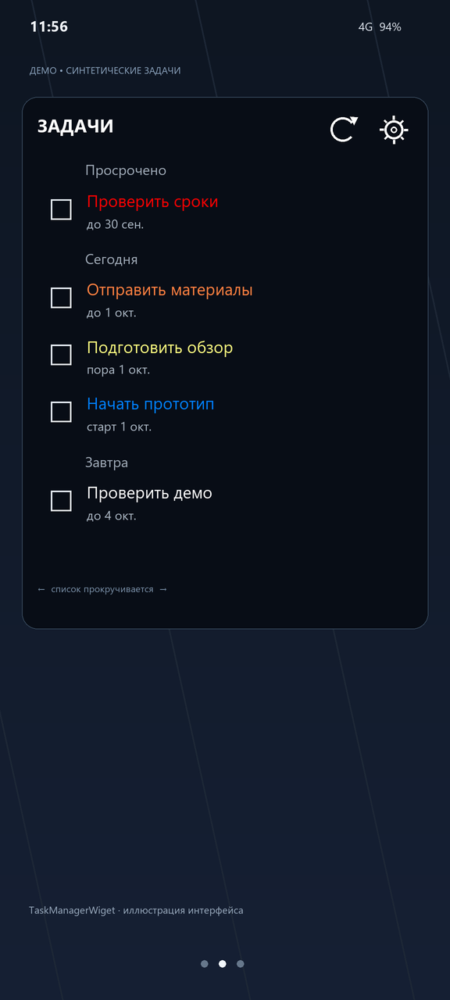
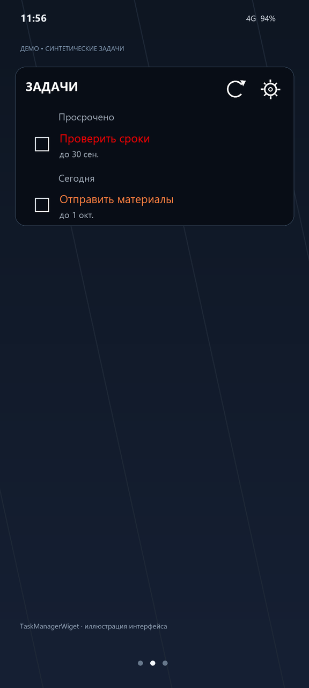

# TaskManagerWiget

Локальное Android-приложение с домашним виджетом задач из Obsidian Vault. Оно читает Markdown через системный Storage Access Framework и не требует аккаунта или доступа в интернет.

## Возможности

- Прокручиваемый список активных задач с выбранным тегом (по умолчанию `#task`): просроченные, сегодня, завтра, ближайшие 14 дней и задачи без даты.
- Цвет названия показывает этап задачи: Start — синий, Scheduled — жёлтый, Due сегодня — оранжевый, просроченный Due — красный.
- Checkbox завершает задачу в исходной заметке, ставит дату `✅` и создаёт следующее повторение для поддерживаемых правил Tasks. Журнал позволяет отменить завершение.
- Кнопка `+` открывает отдельную форму с названием, тегами и датами Start, Scheduled и Due. Задача добавляется в указанный в настройках существующий Markdown-файл внутри Vault; исходный путь — `sl_work/Tasks/Список задач.md`.
- Кнопка обновления перечитывает Vault. Фоновое задание запрашивает обновление примерно раз в 30 минут; Android может отложить его.
- При сканировании удаляются строки завершённых задач с выбранным тегом через три календарных месяца после даты `✅`. Строки без даты завершения сохраняются. Перед записью приложение повторно проверяет файл; при неподтверждённой записи сохраняет резервную копию для восстановления.
- Уведомление показывает дедлайны сегодня и просроченные задачи. В строке статуса состояния различаются формой колокольчика; в раскрытой шторке сегодняшний Due отмечается оранжевым, просрочка — красным. Для Android 13+ нужно разрешение на уведомления.
- Настройки Vault и тега общие; размер шрифта и прозрачность фона сохраняются для каждого экземпляра виджета. Нажатие на название задачи открывает исходную заметку в Obsidian.

## Настройка

1. [Соберите APK](BUILD.md) и установите его на Android 8/API 26 или новее.
2. В приложении выберите папку Vault и предоставьте доступ на чтение и запись.
3. При необходимости измените тег и путь файла для новых задач. Путь задаётся относительно выбранного Vault; файл должен существовать.
4. Добавьте виджет на рабочий стол. Для колокольчика разрешите уведомления в настройках Android.

Обработка Markdown и ограничения безопасной записи описаны в [архитектуре](ARCHITECTURE.md). Проверки и сценарии приёмки — в [TESTING.md](TESTING.md). Код опубликован под [MIT](LICENSE).

## Демо-скриншоты

Макеты интерфейса с синтетическими задачами:

 

Макеты воспроизводятся командой `python scripts/render_demo_screenshots.py` при наличии Pillow и шрифтов Segoe UI.
